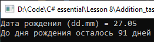

# Lesson8_addition_task
Условия задачки:
>Используя Visual Studio, создайте проект по шаблону Console Application.  
Реализуйте программу, которая будет принимать от пользователя дату его рождения и выводить количество дней до его следующего дня рождения.

Подытог: вот такенный майндфак на выходе
>
